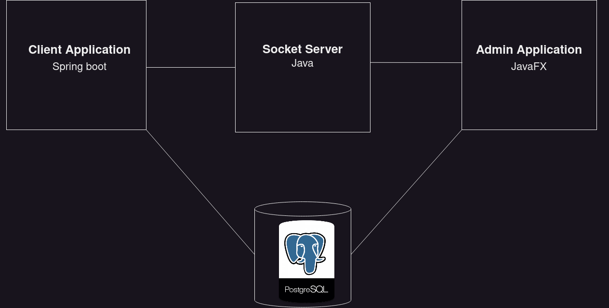

# Library application


## Description : 
Composite of two applications, one for admin and one for clients:

The admin has a desktop application that helps him manage his library. He can list, modify, and insert books, authors, and categories. Additionally, he can manage book reservations.

The client has a web application where they can create an account, sign in, and make a reservation.
## 1 . Technologies : 
 - Spring Boot
 - JavaFX
 - Postgres 
## 2 . Architecture : 
    <br/>

## 3 . Class diagram :

 <br/>

## 4 . Try it: 
 ### Prequesites
 - Java installed (JDK 8 +)
 - Postgres installed in your system .
 ### Step 1 : configure database :  
```
 CREATE USER <USERNAME> WITH PASSWORD <PASSWORD>; //create a user
 CREATE DATABASE <NAME> ; //create a database
 \c <NAME> 
```
 ### Step 2 : configure spring boot : 
Go to the src/main/resources/application.properties file and modify the properties as required. Make sure to change the values of each property discreetly and save the changes before closing the file.
 ```
spring.jpa.properties.hibernate.dialect = org.hibernate.dialect.PostgreSQLDialect
spring.jpa.hibernate.ddl-auto=none
spring.jpa.hibernate.show-sql=true
spring.datasource.url=jdbc:postgresql://localhost:5432/<NAME>
spring.datasource.username=<USERNAME>
spring.datasource.password=<PASSWORD>
server.port=3000
spring.mvc.view.prefix=/WEB-INF/jsp/
spring.mvc.view.suffix=.jsp
```
 ### Step 3 : Run the application
First you should run socket server program follwed by admin javafx application , and then client spring boot application


